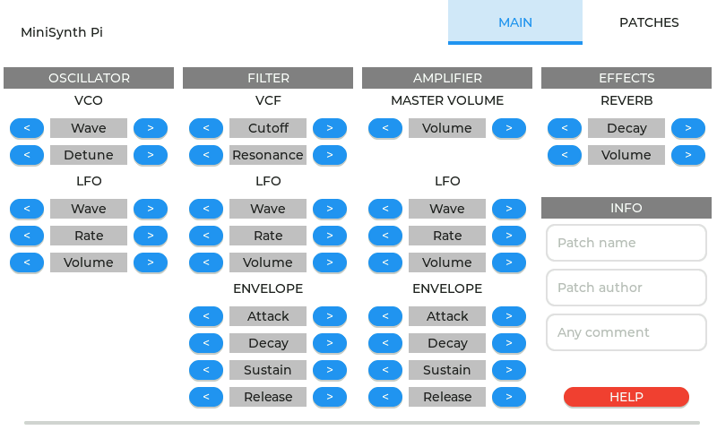
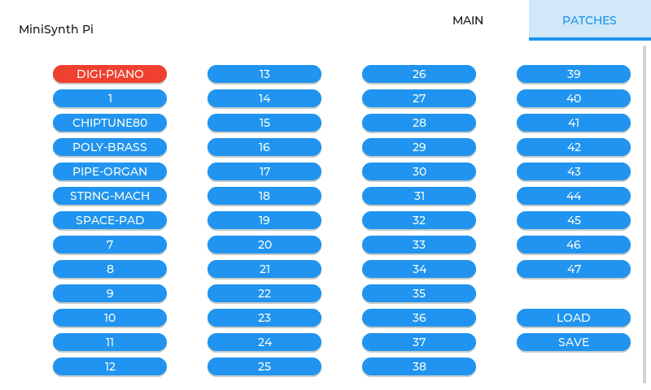
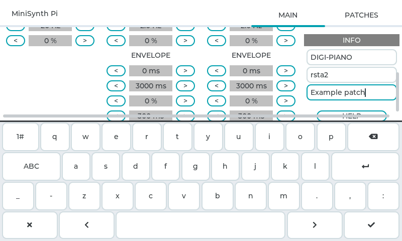

MiniSynth Pi
============

> Raspberry Pi is a trademark of the Raspberry Pi Foundation.

> If you read this file in an editor you should switch line wrapping on.

Overview
--------

MiniSynth Pi is a polyphonic virtual analog audio synthesizer, running bare metal (without separate operating system) on the Raspberry Pi. On the Raspberry Pi 2, 3 and 4 it allows to play up to 24 polyphonic voices at a time, on the Raspberry Pi 1 only 4 voices.

You have to attach an USB MIDI keyboard controller (which supports the USB Audio Class MIDI specification) or an USB PC keyboard to your Raspberry Pi to play on it. Alternatively you can feed serial MIDI data (at 31250 Bps) into GPIO15 (Broadcom numbering). Normally you will need some external circuit to be able to attach a device with serial MIDI interface.

The audio signal is normally available on the 3.5mm headphones jack (I2S usage see below). Thus Raspberry Pi models without headphones jack (e.g. Raspberry Pi Zero) are not supported. The graphical user interface (GUI) of MiniSynth Pi can be controlled using a standard USB mouse, the official Raspberry Pi touch screen or an USB HID-class touch screen in  digitizer mode.

This version of MiniSynth Pi can be built, so that it can be used with an external I2S interface. The audio signal is then available via this interface. MiniSynth Pi has been tested with the following I2S interfaces:

* pHAT DAC (with PCM5102A DAC)
* PiFi DAC+ v2.0 (with PCM5122 DAC)
* [Adafruit I2S Audio Bonnet](https://www.adafruit.com/product/4037) (with UDA1334A DAC)
* [Adafruit I2S 3W Class D Amplifier Breakout](https://www.adafruit.com/product/3006) (with MAX98357A DAC)

Other I2S interfaces with these DACs may be compatible too. The I2C slave address of the PCM5122 DAC is auto-probed (0x4C or 0x4D).

Please note that the included reverb effect module is experimental, because it generates some noise, when no note is played. Just leave the reverb volume (wet/dry ratio) at 0% to eliminate it, if it disturbs.

Getting
-------

Binaries of the latest release of MiniSynth Pi can be downloaded [here](https://github.com/rsta2/minisynth/releases). Just download the *MiniSynthNN.zip* file and follow the instructions in the *INSTALL.md* file, which is included in the archive.

Normally you need a *Git* client to get the MiniSynth Pi source code. Go to the directory where you want to place MiniSynth Pi on your hard disk and enter:

	git clone https://github.com/rsta2/minisynth.git minisynth
	cd minisynth
	git submodule update --init
	cd circle
	git submodule update --init addon/lvgl/lvgl
	cd ..

This will place the source code in the subdirectory *minisynth/* and clones the submodule *circle* (with the required submodule *addon/lvgl/lvgl*) into the *minisynth/circle/* subdirectory.

Building
--------

MiniSynth Pi uses the Circle bare metal build environment for the Raspberry Pi. You need an appropriate compiler toolchain for ARM processors to build it. Have a look at the Circle *README.md* file (in *circle/*) for further information on this (section *Building*). The build information herein is for Linux hosts only.

When the toolchain is installed on your computer you can build MiniSynth Pi using the following commands:

	./configure 3 arm-eabi-
	./makeall clean
	./makeall

The `configure` command writes a *Config.mk* file for Circle and patches Circle, so that it allows to use multiple CPU cores. "3" is the major revision number of your Raspberry Pi (1, 2, 3 or 4). The second (optional) parameter is the prefix of the commands of your toolchain and can be preceded with a path. Do not forget the dash at the end of the prefix!

An optional third parameter can be appended to specify the bit size of the ARM architecture to be used as build target. It can be "32" (default) or "64" (for Raspberry Pi 3 and 4 only).

If you want to build MiniSynth Pi for I2S interface usage, you have to specify the option `--i2s` as first parameter to `configure`.

If the build was successful, you find the executable image file of MiniSynth Pi in the *src/* subdirectory with the name *kernel.img* (Raspberry Pi 1), *kernel7.img* (Raspberry Pi 2), *kernel8-32.img* (Raspberry Pi 3) or *kernel7l.img* (Raspberry Pi 4).

Installation
------------

You will need a SD card with FAT16 or FAT32 partition to install MiniSynth Pi. This partition must be the first file system on the SD card. You have to copy the *kernel???.img* file, built in the previous step, to this FAT partition. All files have to be placed in the root directory of this partition.

Furthermore you need the Raspberry Pi firmware. You can get it as follows:

	cd circle/boot
	make

You have to copy the three files *bootcode.bin*, *start.elf* and *fixup.dat* from the *circle/boot/* subdirectory to the FAT partition on the SD card. The Raspberry Pi 4 requires different firmware files. Please read the file *circle/boot/README* for details!

Finally you have to copy the configuration files *cmdline.txt*, *patchN.txt* (example patches), *velocity-???.txt* (keyboard velocity curve) and *midi-cc.txt* (MIDI CC mapping) from the *config/* subdirectory to the SD card. The appropriate velocity curve file has to be renamed to *velocity.txt* to be used. You can optionally create a subdirectory */patches* and copy the example patches there, if you do not want to have them in the root directory of your SD card.

Put the SD card into the card reader of your Raspberry Pi.

USB Touch Screen Calibration
----------------------------

If you want to use an USB touch screen, an additional calibration step may be required. Your touch screen must be compliant with the USB HID-class specification and must support the digitizer mode. Touch screens which emulate an USB mouse with absolute coordinates cannot be used. Touch screen calibration is needed, if your touch screen does not send screen pixel coordinates. If you are unsure about this, you can apply this step and will get the required information from the calibration program.

After building the MiniSynth Pi application, enter from MiniSynth Pi project root:

	cd circle/tools/touchscreen-calibrator
	make clean
	make

A file *kernel???.img* should be created, which is the calibration program. Copy it to the SD card, which has been prepared in the previous step. Because the kernel image of MiniSynth Pi is needed later, you should temporary rename it. Now put the SD card into your Raspberry Pi and start it. Please read the file *README* in the subdirectory of the calibration program for further info on the calibration process!

The calibration program will finally tell you, if your touch screen needs calibration. If so, the option `touchscreen=min-x,max-x,min-y,max-y` (parameters given by the calibration program) has to be added to the first line of the file *cmdline.txt*. Multiple options will be delimited with a space character in this file.

Using
-----

Before powering on your Raspberry Pi, the following devices have to be attached:

* HDMI display (1920x1080 pixels max.)
* USB MIDI keyboard controller, USB PC keyboard or device with serial MIDI interface (at GPIO15, requires external circuit)
* Standard USB mouse (if touch screen is not used)
* Headphones or amplifier (on the 3.5mm jack or via external I2S interface)

MiniSynth Pi starts in about four seconds. It is controlled using the following GUI (*MAIN* tab):

You will get that picture when you click the *HELP* button with the mouse or on the touch screen. By default the GUI does not show the help info, but the values of the different parameters of the currently selected patch (see *Parameters*).

A parameter value can be modified using the down (<) and up (>) buttons or can be directly entered using a screen keyboard for numeric parameters, when the parameter value is clicked with the mouse or touched on a touch screen.

The GUI allows to select 48 different sound configurations (patches 0-47) on the *PATCHES* tab:

There is always one (highlighted) active patch, which can be edited using the different parameter controls on the *MAIN* tab (see above). A tab can be selected by clicking on its name in the top right corner of the screen.

The parameters of the active patch can be saved to a configuration file on the SD card (*patchX.txt* where X is the number of the patch). If the subdirectory */patches* exists, the patches will be saved here. On start-up the configuration of all patches is loaded from these files (if available) or initialized to the default preset.

A patch can be described with the additional one-line text properties *Patch name*, *Patch author* and *Any comment*. To edit one of these strings, just click into the corresponding text box. The GUI will open a screen keyboard then:

After editing one property, you can save it using the OK check (in the bottom right corner) or reject the latest changes by clicking on the cross (left corner). The *ENTER* key has no function here. Please note that any changes will be saved to a patch file only when you click the *SAVE* button on the *PATCHES* tab.

The USB PC keyboard allows playing two octaves (keys C2-C4). Its mapping is as follows:

	   +-----+-----+     +-----+-----+-----+
	   |2 C#2|3 D#2|     |5 F#2|6 G#2|7 A#3|
	+--+--+--+--+--+--+--+--+--+--+--+--+--+--+
	|Q C2 |W D2 |E E2 |R F2 |T G2 |Y A3 |U B3 |
	+-----+--+--+--+--+--+--+--+--+--+--+--+--+--+
	         |S C#3|D D#3|     |G F#3|H G#3|J A#4|
	      +--+--+--+--+--+--+--+--+--+--+--+--+--+--+-----+
	      |Z C3 |X D3 |C E3 |V F3 |B G3 |N A4 |M B4 |, C4 |
	      +-----+-----+-----+-----+-----+-----+-----+-----+

	+--------+
	|Key Note|
	+--------+

The inscription of the keyboard may vary, but the physical position of the piano keys is the same on all keyboards. Using this scheme you should be able to find them. Please note that PC keyboards often do not allow to use all voices simultaneously.

A Raspberry Pi running MiniSynth Pi can be powered off at any time when the green activity LED is not on.

Parameters
----------

One patch of MiniSynth Pi has the following parameters:

| Section    | Module   | Parameter | Unit | Range     | Default | Description          | MIDI CC |
| ---------- | -------- | --------- | ---- | --------- | ------- | -------------------- | ------- |
| OSCILLATOR | VCO      | Wave      |      |           | Square  | Waveform (*)         |         |
| OSCILLATOR | VCO (2)  | Detune    | %    | 0-200     | 100     | Semitone -/+         | 94 (**) |
| OSCILLATOR | LFO      | Wave      |      |           | Sine    | Waveform (*)         |         |
| OSCILLATOR | LFO      | Rate      | Hz   | 1-35      | 20      | Modulation frequency |         |
| OSCILLATOR | LFO      | Volume    | %    | 0-100     | 0       | Modulation volume    |         |
| FILTER     | VCF      | Cutoff    | %    | 10-100    | 80      | Cutoff frequency     | 74      |
| FILTER     | VCF      | Resonance | %    | 0-100     | 50      | Resonance parameter  | 71      |
| FILTER     | LFO      | Wave      |      |           | Sine    | Waveform (*)         |         |
| FILTER     | LFO      | Rate      | Hz   | 0.5-5.0   | 2.0     | Modulation frequency |         |
| FILTER     | LFO      | Volume    | %    | 0-100     | 0       | Modulation volume    |         |
| FILTER     | ENVELOPE | Attack    | ms   | 0-2000    | 0       | Attack delay         |         |
| FILTER     | ENVELOPE | Decay     | ms   | 100-10000 | 4000    | Decay delay          |         |
| FILTER     | ENVELOPE | Sustain   | %    | 0-100     | 100     | Sustain level        |         |
| FILTER     | ENVELOPE | Release   | ms   | 0-5000    | 1000    | Release delay        |         |
| AMPLIFIER  |          | Volume    | %    | 0-100     | 50      | Master volume        | 7       |
| AMPLIFIER  | LFO      | Wave      |      |           | Sine    | Waveform (*)         |         |
| AMPLIFIER  | LFO      | Rate      | Hz   | 0.5-5.0   | 2.0     | Modulation frequency |         |
| AMPLIFIER  | LFO      | Volume    | %    | 0-100     | 0       | Modulation volume    |         |
| AMPLIFIER  | ENVELOPE | Attack    | ms   | 0-2000    | 100     | Attack delay         |         |
| AMPLIFIER  | ENVELOPE | Decay     | ms   | 100-10000 | 4000    | Decay delay          |         |
| AMPLIFIER  | ENVELOPE | Sustain   | %    | 0-100     | 100     | Sustain level        |         |
| AMPLIFIER  | ENVELOPE | Release   | ms   | 0-5000    | 100     | Release delay        |         |
| EFFECTS    | REVERB   | Decay     | %    | 0-50      | 20      | Rate of decay        |         |
| EFFECTS    | REVERB   | Volume    | %    | 0-30      | 0       | Wet/dry ratio        | 91      |

(*) Waveform can be: Sine, Square, Sawtooth, Triangle, Pulse 12.5%, Pulse 25% or Noise (Noise not for LFO)

(\*\*) The MIDI CC mapping can be modified in the file *midi-cc.txt*. This is the default mapping.

MiniSynth Pi provides two VCOs, one runs at the pitch frequency, the other at pitch frequency detuned by a configurable value (max. one semitone - or +, default 100% = Detune off). The VCF uses a second order recursive linear filter, containing two poles and two zeros (biquad), which is implemented as a low-pass filter.

MiniSynth Pi allows to use a specific keyboard velocity curve, which fits best to your keyboard and your playing style. It has to be provided in the file *velocity.txt* on the SD card. The default velocity curve is linear. Have a look into the example files in the *config/* subdirectory. If you want to use one of these files, it has to be renamed to *velocity.txt* on the SD card. It should be easy to modify one example file to adjust the velocity curve to your own needs.

Troubleshooting
---------------

Some USB MIDI keyboard controllers have been reported to lose "Note on" and/or "Note off" events, if used with MiniSynth Pi. As a workaround you can modify the file *cmdline.txt* on the SD card as follows:

	logdev=null usbspeed=full

Some USB PC keyboards may not work with MiniSynth Pi, because its USB HID report descriptor cannot be fetched from the keyboard. As a workaround you can try to suppress fetching this descriptor by adding the `usbignore=` option to the file *cmdline.txt* on the SD card:

	logdev=null usbspeed=auto usbignore=int3-0-0

Please note, that you cannot use an USB PC keyboard to input data in MiniSynth Pi. It is just an replacement for an USB MIDI keyboard controller, in case you do not have the latter.

Credits
-------

MiniSynth Pi uses the following source modules:

* [Circle C++ bare metal environment for the Raspberry Pi](https://github.com/rsta2/circle/) (includes USB MIDI driver by Joshua Otto)
* [Light and Versatile Graphics Library](https://lvgl.io/) by LVGL LLC
* [EMMC SD card driver (part of rpi-boot)](https://github.com/jncronin/rpi-boot/blob/master/emmc.c) by John Cronin
* [FatFs file system module](http://elm-chan.org/fsw/ff/00index_e.html) by ChaN

Additional information has been obtained from:

* [Cookbook formulae for audio EQ biquad filter coefficients](https://webaudio.github.io/Audio-EQ-Cookbook/Audio-EQ-Cookbook.txt) by Robert Bristow-Johnson
* [Digital Synth WRA32](https://github.com/risgk/digital-synth-wra32/) by Ryo Ishigaki
* [Effect Design, Part 1: Reverberator and Other Filters](https://ccrma.stanford.edu/~dattorro/EffectDesignPart1.pdf) by Jon Dattorro
